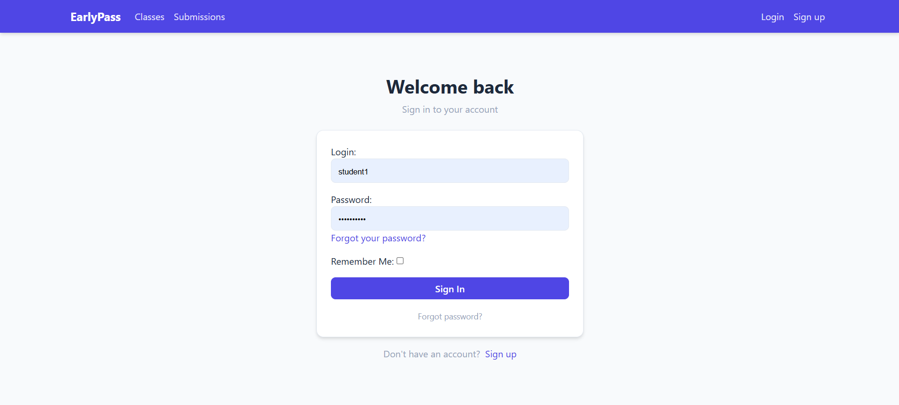
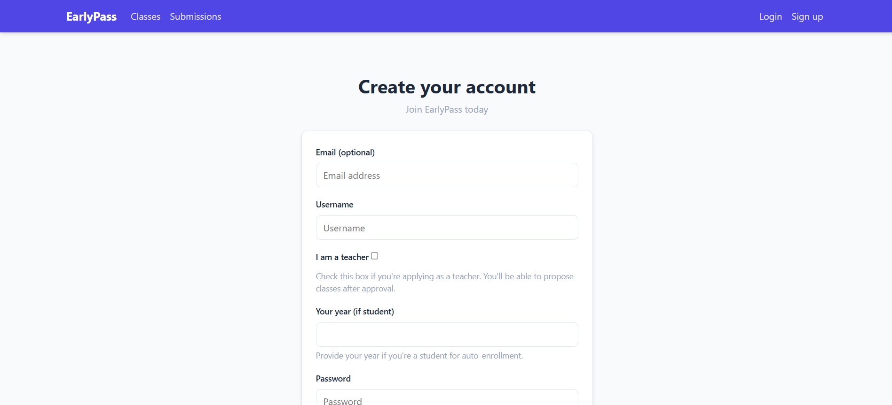
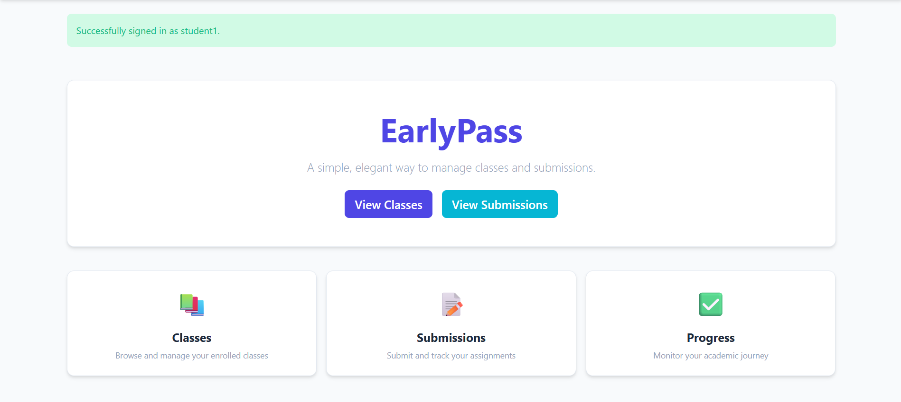
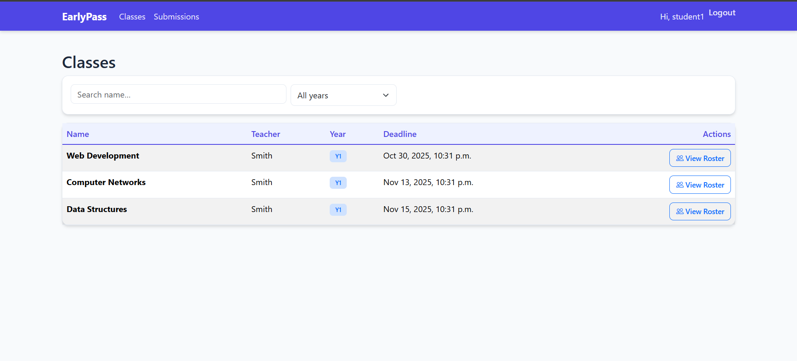
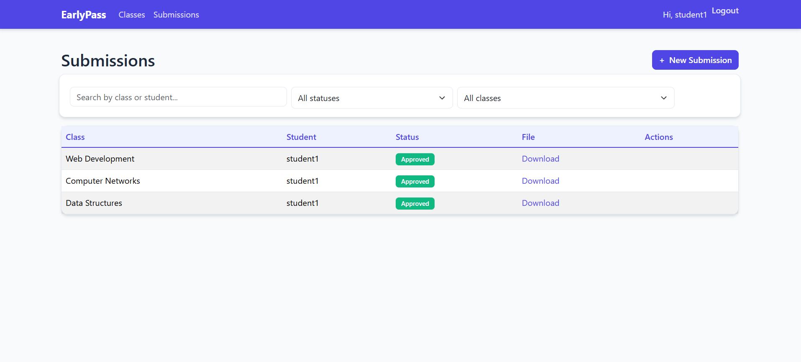
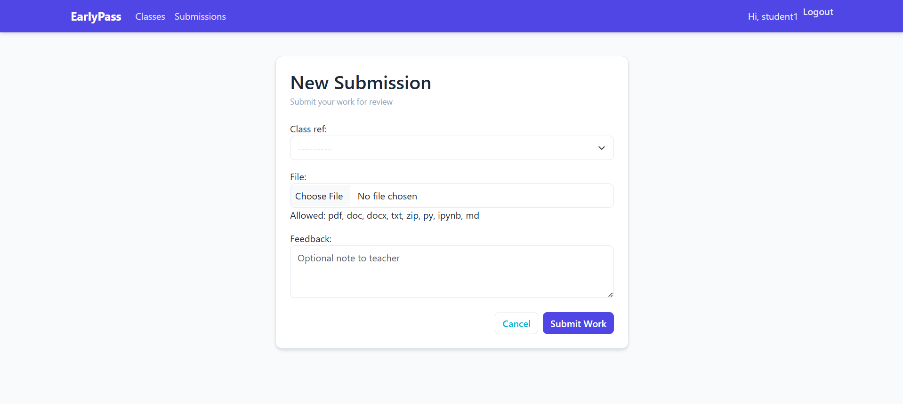
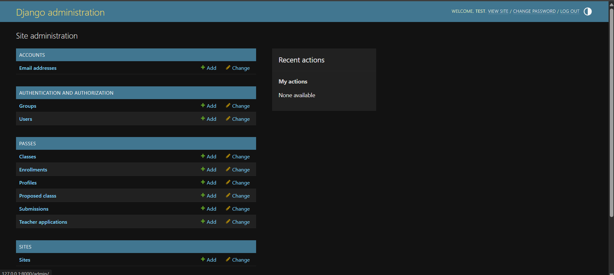

# EarlyPass – Class & Submission Management System

<div align="center">


EarlyPass is a modern class management and submission platform that connects students, teachers, and administrators, where students can submit their assignments required to early pass a class. Teachers propose classes which must be approved by admins. Students are automatically enrolled based on their year, can submit assignments, and receive feedback. Teachers review submissions and track student progress.

</div>

---

## ✨ Features

- **Role-Based Access**: Students, Teachers, and Admin with distinct permissions
- **Teacher Application**: Teachers apply during signup and are activated after admin approval
- **Class Proposals**: Teachers propose classes; admins approve to create and auto-enroll students
- **Auto-Enrollment**: Students automatically enrolled in classes matching their year
- **Submissions**: File uploads with approval workflow and deadline enforcement
- **Class Roster**: View enrolled students with submission status and statistics
- **Filters**: Live filtering using HTMX (no page reloads)
- **Email Notifications**: Admin alerts for new teacher applications
- **Password Reset**: Complete email-based password reset flow
- **Modern UI**: Responsive Bootstrap 5 design with custom color palette

---

## 🛠 Tech Stack

**Backend:** Django 5.2.7 • django-allauth • django-filter • django-htmx • Gunicorn  
**Frontend:** Bootstrap 5 • HTMX • Bootstrap Icons  
**Database:** SQLite (dev) • PostgreSQL-ready (production)  
**Deployment:** Docker • WhiteNoise • Environment-based config  
**Testing:** pytest • pytest-django • 88% coverage

---

## 🚀 Getting Started

### Local Development

```bash
# Clone repository
git clone <repository-url>
cd WebAppProject

# Setup virtual environment
python -m venv .venv
.venv\Scripts\activate  # Windows
source .venv/bin/activate  # Unix/Mac

# Install and setup
pip install -r requirements.txt
python manage.py migrate
python manage.py createsuperuser
python manage.py seed_demo  # Optional demo data
python manage.py runserver
```

**Access:** http://localhost:8000 | **Admin:** http://localhost:8000/admin

### Docker Deployment

```bash
docker compose up --build -d
docker compose exec web python manage.py createsuperuser
```

**Access:** http://localhost:8000
   - App: http://localhost:8000
   - Admin: http://localhost:8000/admin

4. **View logs**
   ```bash
   docker compose logs -f
   ```

**Access:** http://localhost:8000

**Demo Credentials:** After running `seed_demo`:
- Students: `student1-15` / `student123`
- Teachers: `teacher1-3` / `teacher123`

---

## 👥 Quick Workflows

**Students:** Signup → Auto-enrolled in year classes → Submit assignments → Track status  
**Teachers:** Signup → Admin approval → Propose classes → Admin approval → Review submissions  
**Admins:** Approve teachers → Approve class proposals → Monitor system

---

## 📸 Screenshots

### Login & Signup
<p align="center">
  
  
</p>

### Student Dashboard & Classes
<p align="center">
  
  
</p>

### Submissions & Forms
<p align="center">
  
  
</p>

### Admin Panel
<p align="center">
  
</p>

---

## 🧪 Testing

**Current Coverage:** 88%

```bash
# Run all tests
pytest

# With coverage report
pytest --cov=passes --cov-report=html

# Specific test file
pytest passes/tests/test_auth.py -v
```

**Test Files:** `test_auth.py`, `test_basic.py`, `test_views_and_forms.py`, `test_signals_and_ui.py`

---

## 🔧 Management Commands

```bash
# Seed demo data (15 students, 3 teachers, 9 classes)
python manage.py seed_demo

# Fix teacher activation status
python manage.py fix_teacher_activation

# Fix proposed classes
python manage.py fix_proposed_classes
```

---

## ⚙️ Configuration

**Key Settings in `earlypass/settings.py`:**
- `ADMINS` – Email notifications for teacher applications
- `EMAIL_BACKEND` – Console (dev) or SMTP (prod)
- `ACCOUNT_FORMS` – Extended signup form for teacher registration
- `DEFAULT_CLASS_DEADLINE_DAYS` – Default deadline for new classes (30 days)

**For Production:** Configure `DJANGO_SECRET_KEY`, `DJANGO_DEBUG=False`, `DJANGO_ALLOWED_HOSTS` in docker-compose.yml

---

